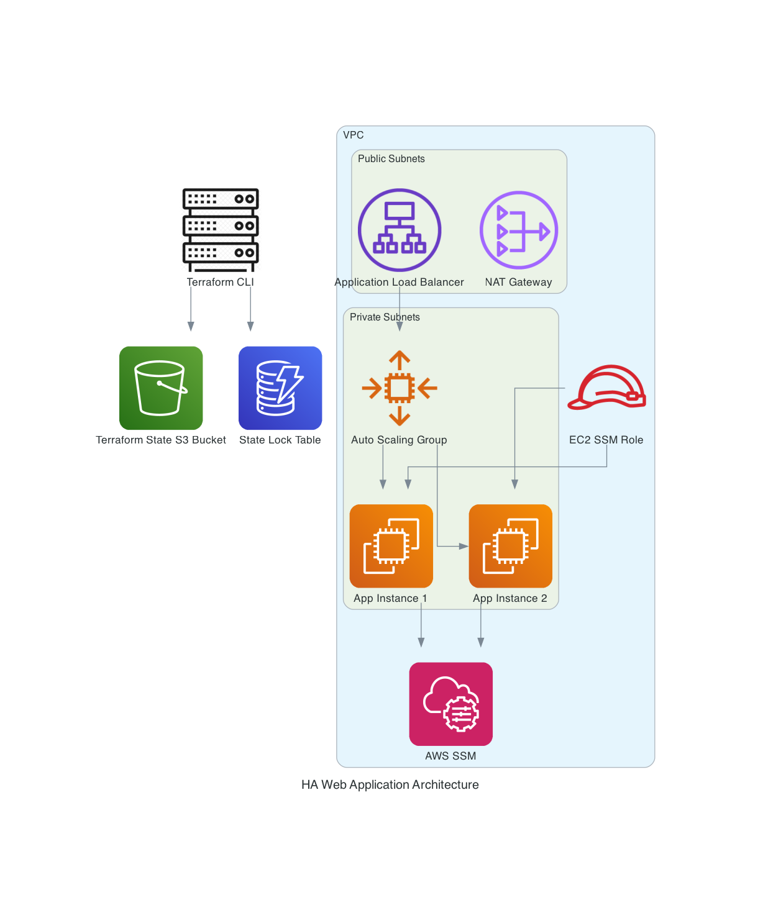

# DevOps Challenge: Highly Available & Secure Web Application Infrastructure

## Project Overview
This repository provisions a secure, highly available AWS infrastructure for running a web application using Terraform. It leverages best practices for networking, access, and automation.

### Key Components
- **VPC (Virtual Private Cloud):** Provides network isolation and segmentation between public and private resources.
- **Public Load Balancer (ALB):** Distributes incoming traffic to application servers, ensuring high availability and scalability.
- **Auto Scaling Group (ASG):** Automatically manages EC2 instances to ensure the desired capacity and health.
- **Security Groups:** Act as virtual firewalls to tightly control traffic between resources.
- **AWS SSM (Systems Manager) Session Manager:** Securely manages access to EC2 instances without opening SSH ports or managing keys.

---

## Architecture Rationale

### Why Use a VPC?
A VPC provides a logically isolated network within AWS. It allows you to:
- Define subnets (public/private) for granular control over resource exposure.
- Enforce security boundaries between tiers (e.g., web, app, DB).
- Control routing, NAT, and firewall rules.

### Why Use SSM Session Manager?
- **No SSH keys or open ports:** SSM enables direct, auditable shell access to EC2 instances without requiring SSH or bastion hosts.
- **Security:** All connections are encrypted, access is logged, and IAM policies control who can connect.
- **Operational Simplicity:** No need to manage key rotation or expose instances to the public internet.

### Why a Public Load Balancer?
- The ALB is deployed in public subnets to expose the application to the internet, while EC2 instances remain in private subnets for security.
- This pattern ensures only HTTP/HTTPS traffic reaches the app, and only through the load balancer.

### Security Group Design
- **ALB Security Group:** Allows inbound HTTP from anywhere (0.0.0.0/0) and forwards traffic to EC2 instances.
- **EC2 Security Group:** Only allows inbound HTTP from the ALB (not from the internet), and allows egress as needed.
- This minimizes the attack surface and follows the principle of least privilege.

---

## Step-by-Step Usage Guide

### Prerequisites
- [Terraform](https://www.terraform.io/downloads.html) installed
- [AWS CLI](https://aws.amazon.com/cli/) installed and configured (`aws configure`)
- AWS account with permissions to create VPC, EC2, ALB, IAM, and SSM resources

### 1. Clone the Repository
```sh
git clone <repo-url>
cd devops-challenge
```

### 2. Create the Remote Backend (State Storage)
Before applying the main infrastructure, you must create the S3 backend for Terraform state management:
```sh
cd terraform/backend
terraform init
terraform apply
cd ../
```

### 3. Initialize Terraform for the Main Infrastructure
```sh
cd terraform
terraform init
```

### 4. Review and Apply the Main Infrastructure
```sh
terraform plan
terraform apply
```

### 4. Access the Application
After a successful apply, Terraform will output the DNS name of the Application Load Balancer:
```sh
terraform output alb_dns_name
```

> **Note:**
> After the EC2 instances are created, the Application Load Balancer (ALB) will only start routing traffic to them once they pass the configured health checks. This process can take a few minutes (e.g., up to 2-3 minutes depending on your health check interval and thresholds). Until then, you may see a 503 error or "service unavailable" when accessing the ALB DNS. This is expected behavior while the instances register and become healthy.

Open the DNS name in your browser to access the web application once the health checks have passed.

### 5. Access EC2 Instances via SSM (No SSH Required)
1. **Get the EC2 Instance IDs managed by the Auto Scaling Group:**
   ```sh
   terraform output asg_instance_ids
   ```
   This returns a list of instance IDs (e.g., `i-0abcd1234efgh5678`).

2. **Start a Session with SSM:**
   ```sh
   aws ssm start-session --target <INSTANCE_ID> --region us-east-1
   ```
   Replace `<INSTANCE_ID>` with one from the previous step.

#### Why is SSM access better?
- No need to open SSH ports or manage SSH keys.
- All access is controlled and logged by AWS IAM and CloudTrail.
- You can restrict who can access which instances via IAM policies.

---

## Outputs
- `alb_dns_name`: DNS name of the Application Load Balancer
- `asg_instance_ids`: List of EC2 instance IDs in the Auto Scaling Group (for SSM access)
- `ssm_command_example`: Example AWS CLI command for SSM session

---

## Security Considerations
- **No EC2 instance has a public IP.** All inbound app traffic flows through the ALB.
- **SSM Session Manager** is the only method to access EC2 shells; SSH is not used or required.
- **IAM roles** are used for least-privilege permissions for both EC2 and SSM.

---

## Architecture Diagram

The following diagram illustrates the high-level AWS infrastructure and Terraform backend used in this project:



*Generated by [diagram.py](diagram.py) using [mingrammer/diagrams](https://github.com/mingrammer/diagrams). To update or regenerate, simply run the script. The PNG will appear automatically in the repo.*

---

## Further Improvements
- Enable HTTPS on the ALB for encrypted traffic.
- Add WAF (Web Application Firewall) for extra protection.
- Use SSM Parameter Store or Secrets Manager for managing secrets.
- **Add a Firewall VM in front of the ALB:**
    - For advanced traffic inspection or compliance, you may add a firewall VM (e.g., pfSense, FortiGate, NGFW) as a reverse proxy in front of the ALB.
    - In this pattern, the firewall VM receives all inbound traffic from the internet, inspects/filters it, and then forwards allowed traffic to the ALB (which should be made internal/private).
    - Your public DNS (e.g., app.example.com) should point to the Elastic IP of the firewall VM, not directly to the ALB DNS.
    - This requires architectural changes: the ALB must be private, and the firewall VM must be highly available and able to forward traffic to the ALB.
    - For most HTTP(S) use cases, consider AWS WAF as a managed alternative.

---

## References
- [AWS VPC Documentation](https://docs.aws.amazon.com/vpc/latest/userguide/what-is-amazon-vpc.html)
- [AWS SSM Session Manager](https://docs.aws.amazon.com/systems-manager/latest/userguide/session-manager.html)
- [AWS ALB Documentation](https://docs.aws.amazon.com/elasticloadbalancing/latest/application/introduction.html)


